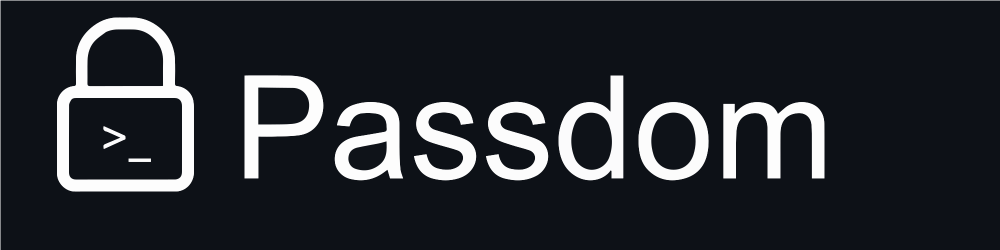

# 🔑 passdom 🔑

<centre></centre>
Every day, we utilise passwords. However, did we have a secure means to keep passwords? Browsers can retain passwords for the web, but what about CLI and terminals?

Passdom is here for help. Passdom is a CLI tool, built to help you store your credentials on the Command line or terminal

It takes less than 10 seconds to store your password and less than a second to retrieve them. You can store passwords for multiple websites and tools.


## Installation 📥
> Install globally to use in any directory.
```
$ npm install -g passdom
```

## Basic Usage 📒
```js
passdom -a <website name> // to add your credentials, it will ask you your credentials {Website name is the name of site of which you have to add credentials}

passdom <website name> //to find the credentials of the given website

passdom -r <website name> // to remove the credentials of given website

passdom -ls // to list all your credentials
```
```js
passdom add <website name> // to add your credentials, it will ask you your credentials {Website name is the name of site of which you have to add credentials}

passdom <website name> //to find the credentials of the given website

passdom remove <website name> // to remove the credentials of given website

passdom list // to list all your credentials

```

## Privacy 🔒

We respect your privacy and are constantly working on it.
All the credentials are stored on your local computer, so any third party can't get access to them other than you.

## Contribute 📂

If you want to contribute, check out the GitHub repository 
https://github.com/zeel-pathak/passdom

Contributions are welcome!!
 
## Open Source 👐

Hell Yeah

passdom can easily be installed in your networks, and it is all Free and Open Source
* [ Source Code ] -> https://github.com/zeel-pathak/passdom

## Future update 🔥

* Currently, passdom can only store one credential for a particular website, we want passdom to be able to store multiple credentials for a website.
* Finding credentials should be made easier.
* Extra flags should be added to help and made easy to use as well as a flag to list all credentials.
* Should ask again for confirmation while removing.
